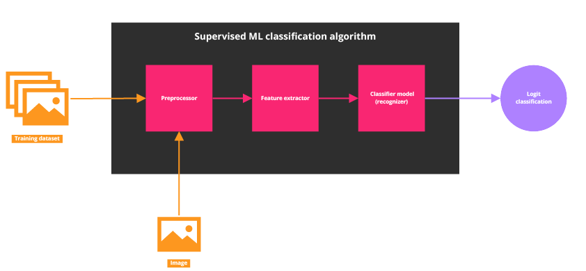

# Landscape recognizer
 
Supervised ML classification algorithm implemented through pattern recognition techniques and statistical methods.

## Table of contents

* [Landscape recognizer](#landscape-recognizer)
  * [Table of contents](#table-of-contents)
  * [Project description](#project-description)
    * [Constraints](#constraints)
  * [Algorithm design and implementation](#algorithm-design-and-implementation)
    * [Feature vector definition](#feature-vector-definition)
    * [Pattern recognition and learning algorithm](#pattern-recognition-and-learning-algorithm)
    * [Implementation](#implementation)
  * [Resulting model](#resulting-model)
  * [Testing](#testing)
    * [Testing results](#testing-results)
  * [Conclusion](#conclusion)
  * [Author](#author)
  * [License](#license)

## Project description

This project is focused on the design, implementation, and testing of a supervised machine learning algorithm aimed at **detecting urban-natural landscapes**. Leveraging pattern recognition techniques and statistical methods, the algorithm goal is to accurately logit classify images based on their color profile features. By harnessing the power of machine learning, this approach offers the potential to automate the identification process, enabling efficient analysis of large-scale datasets.

As result, the trained model is expected to be capable of determine with a high level of effectiveness if a given picture is an urban-natural landscape or not.  

### Constraints

1. The model must be trained with a limited dataset (12 samples).
2. The recognizer must rely on a model comprising only 3 features.
3. The features constituting the model must be exclusively extracted from the color profile of the images. The use of edge-based features is off the table. 

## Algorithm design and implementation

### Feature vector definition

In order to understand the problem to be solved consider the following definition: A picture catalogued as urban-natural landscapes must fulfill the following criteria:

1. The image depicts clear daytime skies or moderate cloud cover.
2. The horizon line is visible in the image.
3. The image portrays solid ground.
4. Bodies of water may or may not be visible in the image.

With the characterization provided above the feature vector is defined as follows:

$$ featureVector = (skyIdxArea, greenIdx, blueIdx) $$

Where each feature is defined down bellow:

* **skyIdxArea:** Compound and area bounded index that measures the sky level in the picture. This feature combines a blue mask (_RGB_ color profile) with a brightness mask (_HSV_ color profile) to discriminate sky color within a limited zone.
* **greenIdx:** Index that measures the nature level in the picture. This feature uses a green mask (_RGB_ color profile) to discriminate vegetation. 
* **blueIdx:** Index that measures the urban buildings level in the picture. This feature uses a blue mask (_RGB_ color profile) to discriminate urban facades.

### Pattern recognition and learning algorithm

The structure and data flow of the implemented supervised ML classification algorithm is presented in the diagram down bellow.

When input data enters the classification algorithm it is pre-processed, its features are extracted and lastly the classification model is either trained or used to determine the nature of the given picture. In the recognition process the result is a logit classification.

### Implementation

This project is implemented using Python 3.11 with openCV and NumPy as supporting libraries to perform image manipulation and matrix operations. Check the code base in the [GitHub repository](https://github.com/andresmg07/landscape-recognizer/).

## Resulting model

As result of the training stage, two modeling vectors are generated. The first of these vectors: $featureVector$ characterizes the central tendencies of the features extracted, while the second resulting vector: $standardDeviationVector$ reflects their variability across the dataset. The obtained values for each vector are presented down bellow.

$$ trainedFeatureVector \approx (0.1822, 0.0325, 0.3627) $$

$$ featureStandardDeviationVector \approx (0.1906, 0.0185, 0.1146) $$

Through the utilization of these trained model vectors, the algorithm calculates the expected error and gains the capability to make informed decisions regarding the classification of new images.

## Testing

In order to validate the effectiveness of the resulting model a small testing procedure is conducted. The dataset used for this task comprised 20 samples, where half of it are urban-natural landscape pictures and the remaining half are arbitrary selected images.

### Testing results

An automated testing module threw the following results from the classification of the above described validation dataset.

| **Truth Value** | **Quantity** |
|-----------------|--------------|
| True positive   |      4       |
| True negative   |      10      |
| False positive  |      0       |
| False negative  |      6       |

Based on the results presented in the table, **the effectiveness level of the algorithm is approximately 70%**

## Conclusion
As conclusion, while the restrictions imposed on the design of the algorithm present significant challenges, they also foster opportunities for creativity, efficiency, and innovation.  The testing results exhibit a solution with promising performance in detecting urban-natural landscapes, with high precision, strong specificity, and moderate sensitivity. By addressing areas for improvement, the algorithm has the potential to become even more reliable and effective by targeting the source of the false negatives; fine-tuning the algorithm's parameters or incorporating additional features may enhance its sensitivity.

## Author

**Andrés Montero Gamboa** 
Computing engineer 
Graduated from Tecnológico de Costa Rica 
[LinkedIn](https://www.linkedin.com/in/andres-montero-gamboa) | [GitHub](https://github.com/andresmg07)

## License

MIT License

Copyright (c) 2024 Andrés Montero Gamboa

Permission is hereby granted, free of charge, to any person obtaining a copy
of this software and associated documentation files (the "Software"), to deal
in the Software without restriction, including without limitation the rights
to use, copy, modify, merge, publish, distribute, sublicense, and/or sell
copies of the Software, and to permit persons to whom the Software is
furnished to do so, subject to the following conditions:

The above copyright notice and this permission notice shall be included in all
copies or substantial portions of the Software.

THE SOFTWARE IS PROVIDED "AS IS", WITHOUT WARRANTY OF ANY KIND, EXPRESS OR
IMPLIED, INCLUDING BUT NOT LIMITED TO THE WARRANTIES OF MERCHANTABILITY,
FITNESS FOR A PARTICULAR PURPOSE AND NONINFRINGEMENT. IN NO EVENT SHALL THE
AUTHORS OR COPYRIGHT HOLDERS BE LIABLE FOR ANY CLAIM, DAMAGES OR OTHER
LIABILITY, WHETHER IN AN ACTION OF CONTRACT, TORT OR OTHERWISE, ARISING FROM,
OUT OF OR IN CONNECTION WITH THE SOFTWARE OR THE USE OR OTHER DEALINGS IN THE
SOFTWARE.
